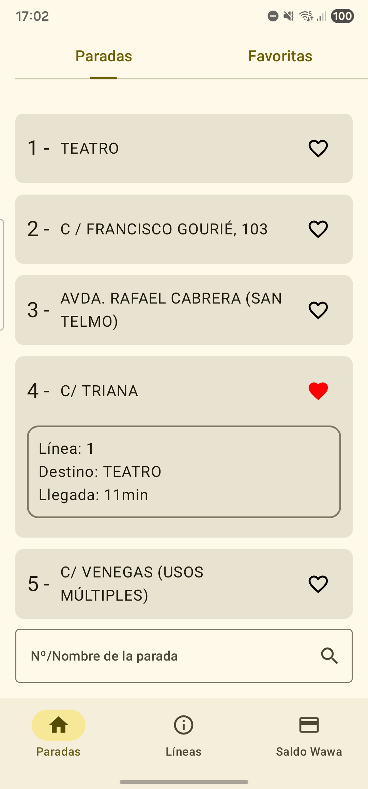
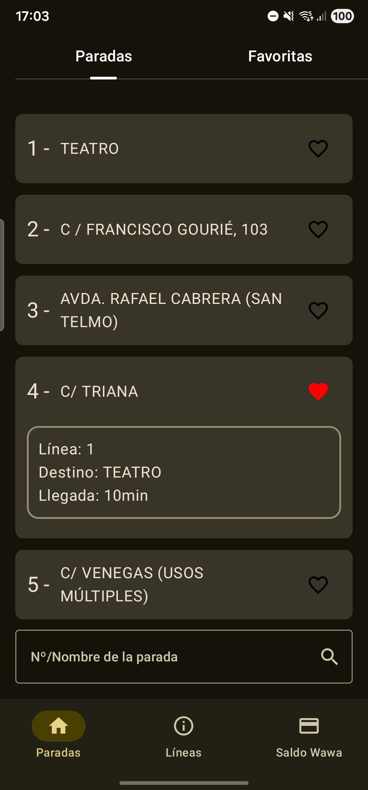
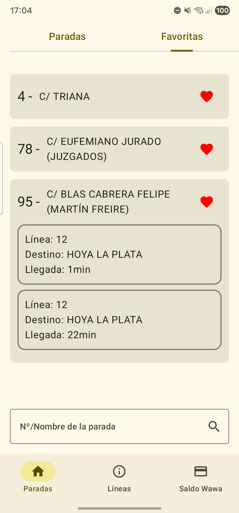
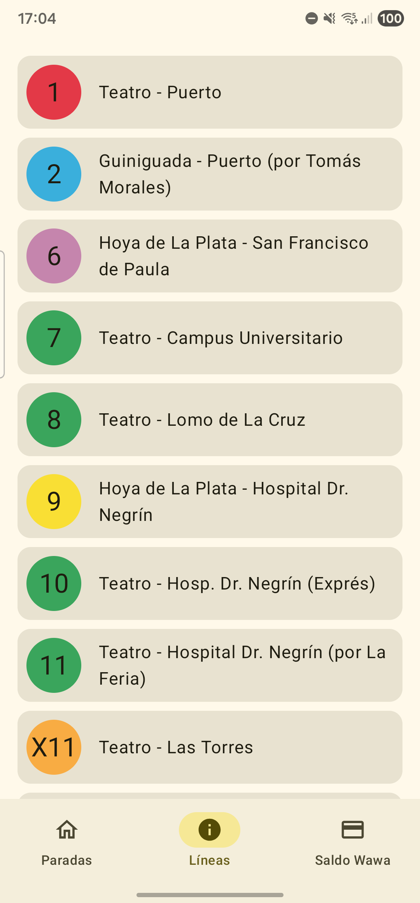
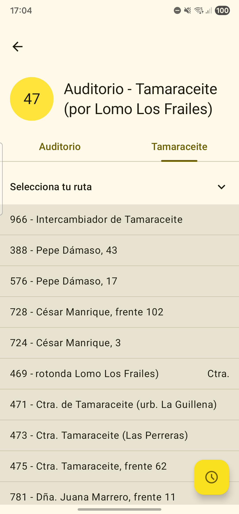
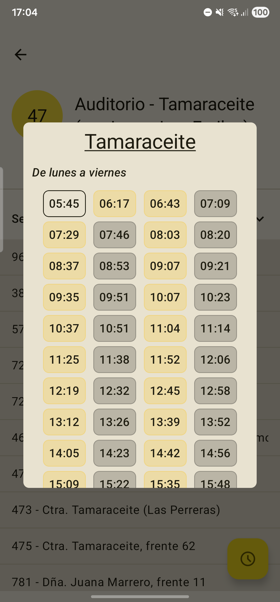
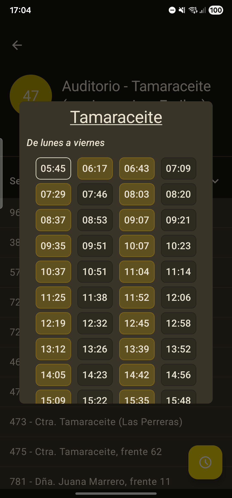
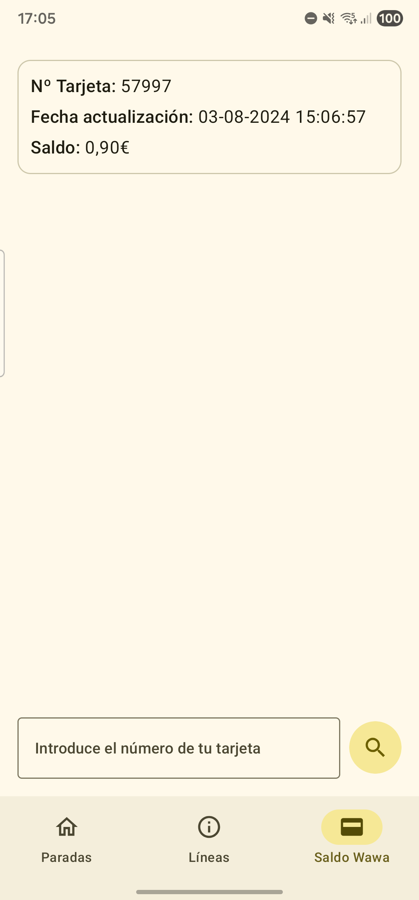
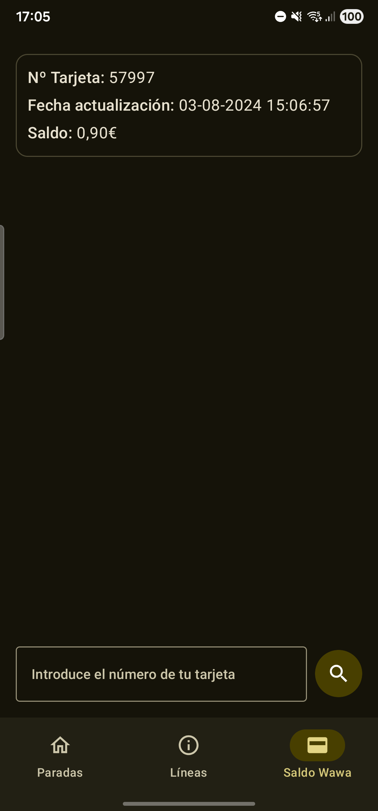

## Wawas amarillo limón.

### Project Status:

### ¿De qué va este repo?

Es una app simple que replica algunas de las funciones de la aplicación original de la compañía de
transportes públicos perteneciente a la ciudad de Las Palmas de Gran Canaria. 🇮🇨

### ¿Que es lo que puedo hacer en la app?

- Consultar la información de la parada en la que te encuentras.
- Seleccionar tus paradas favoritas para un acceso más rápido.
- Consultar la información de las líneas de la ciudad.
- Consultar el horario de cualquier línea.
- Consultar el saldo de tu bono de guaguas.

### ¿Donde me puedo descargar el APK más reciente?

https://github.com/AbrahamCardenes/WawaAmarillaLimon/releases 🚀 (recuerda que es el fichero `.apk`
el que debes seleccionar 🙂)

### ¿Cuál es el propósito?

Principalmente, aprendizaje y ocio sobre el proceso de creación de una aplicación Android con los
estándares más conocidos y usados a día de hoy (02/2025).

### Stack:

- [Kotlin](https://kotlinlang.org/)
- [Jetpack Compose](https://developer.android.com/compose)
- [Retrofit2](https://square.github.io/retrofit/)
- [RoomDB](https://developer.android.com/training/data-storage/room)
- [Hilt](https://dagger.dev/hilt/)
- [Firebase](https://firebase.google.com/)
- [Ktlint](https://pinterest.github.io/ktlint/latest/)
- [Sonar](https://sonarcloud.io/)
- Love and coffee, specially coffee :yellow_heart: :coffee:

## 📱 Screenshots

### 🏃🏻‍➡️ 🚏 Paradas

<table>
  <tr>
    <td align="center">
        
    </td>
    <td align="center">
        
    </td>
  </tr>
  <tr>
    <td align="center">
        
    </td>
    <td align="center">
        
    </td>
  </tr>
</table>

### 🚍 Líneas

<table>
  <tr>
    <td align="center">
        
    </td>
    <td align="center">
        
    </td>
  </tr>
  <tr>
    <td align="center">
        <
    </td>
    <td align="center">
        
    </td>
  </tr>
</table>

### 📅 Horarios

<table>
  <tr>
    <td align="center">
        
    </td>
    <td align="center">
        
    </td>
  </tr>
</table>

### 💳 Saldo

<table>
  <tr>
    <td align="center">
        
    </td>
    <td align="center">
        
    </td>
  </tr>
</table>

#### Firebase:

##### Encoding and decoding command to put google-services.json inside a Github secret.

- Encoding google-services.json: `base64 -i google-services.json -o google-services.b64`
- Decoding: `base64 -D -i google-services.b64 -o google-services-decode.json`
- Notes:
    - You will need to generate your own `google-services.json`
      in [Firebase](https://firebase.google.com/)
    - Execute the command inside the `app` directory, or use it with
      `yourpPath/app/google-services.json`
    - `google-services.json`, `google-services.b64` and `google-services-decode.json` are included
      in `.gitignore`

##### - Check performance

- adb logcat -s FirebasePerformance

#### Misc:

##### List available tasks

`./gradlew :{module_name}:tasks`

##### Pre-commit.

- To allow the pre-commit to be executable you have to type into your terminal the following
  command:
    - chmod +x .git/hooks/pre-commit

    